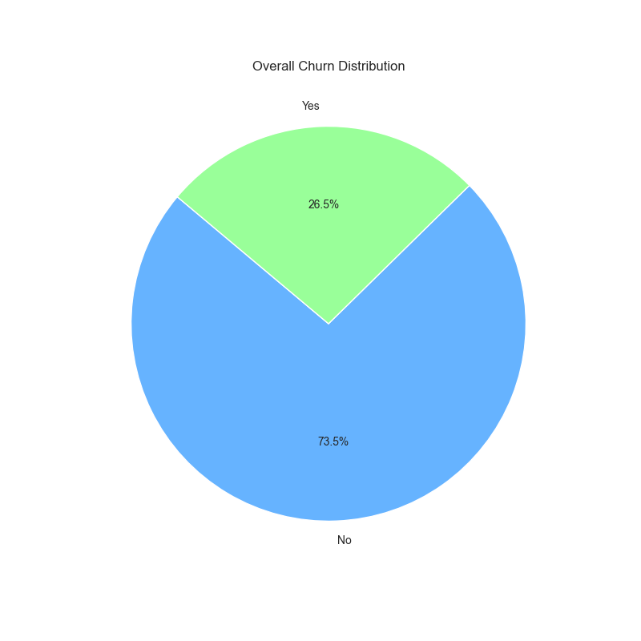
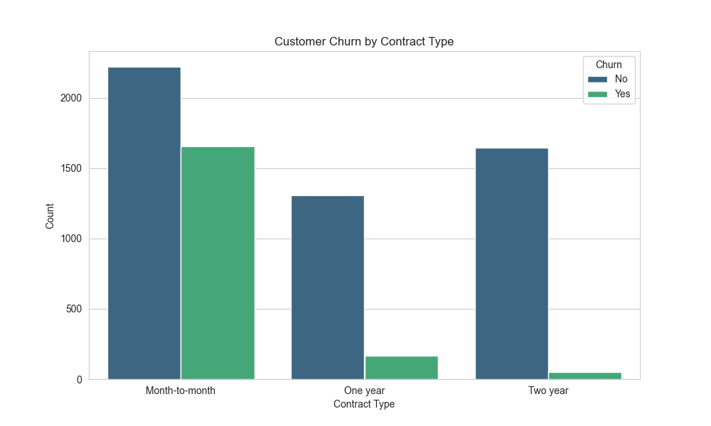
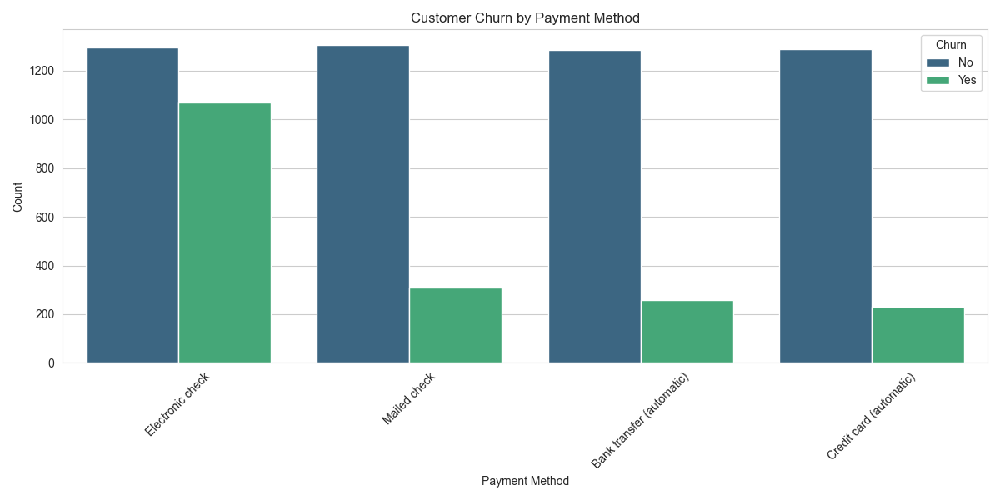
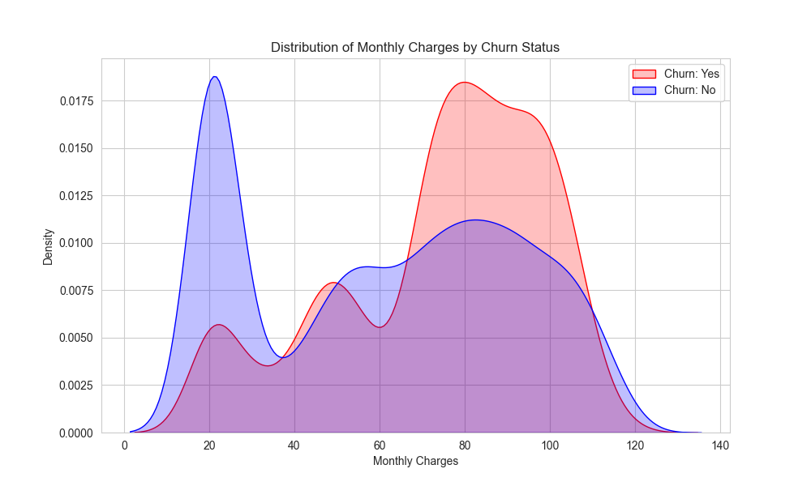

# Customer Churn Analysis

This project analyzes a dataset of customer churn to identify key factors that contribute to customers leaving the service. It includes a Python script to visualize these factors through various graphs.

## Dataset
The dataset `churn_data.csv` contains information about customers, including:
-   **Demographics**: Gender, SeniorCitizen, Partner, Dependents
-   **Services**: PhoneService, MultipleLines, InternetService, etc.
-   **Account Information**: Contract, PaperlessBilling, PaymentMethod, MonthlyCharges, TotalCharges
-   **Target**: Churn (Yes/No)

## Visualizations

Here are the key insights generated from the analysis:

### 1. Overall Churn Distribution

*A pie chart showing the percentage of customers who churned vs. those who stayed.*

### 2. Churn by Contract Type

*Customers with month-to-month contracts tend to have a higher churn rate compared to those with one or two-year contracts.*

### 3. Churn by Payment Method

*Electronic check users often show higher churn rates.*

### 4. Distribution of Monthly Charges

*Higher monthly charges may correlate with higher churn, as seen in the density plot.*

## How to Run locally

1.  **Clone the repository**:
    ```bash
    git clone https://github.com/iffat336/AI_buisness_automation.git
    cd AI_buisness_automation
    ```

2.  **Install dependencies**:
    Make sure you have Python installed, then run:
    ```bash
    pip install pandas matplotlib seaborn
    ```

3.  **Run the analysis**:
    ```bash
    python visualize_churn.py
    ```
    This will generate the visualization images in the `visualizations` folder.

## Files
-   `churn_data.csv`: The raw dataset.
-   `visualize_churn.py`: Python script for generating visualizations.
-   `README.md`: This project documentation.
